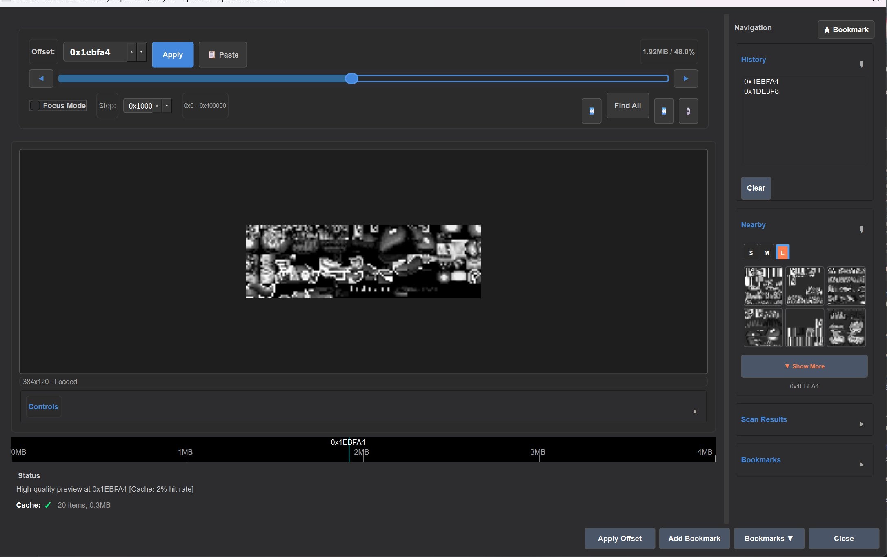
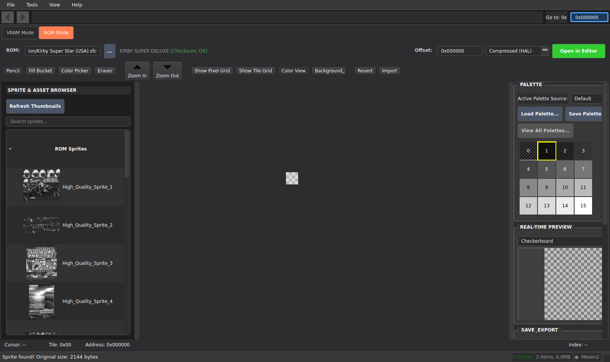
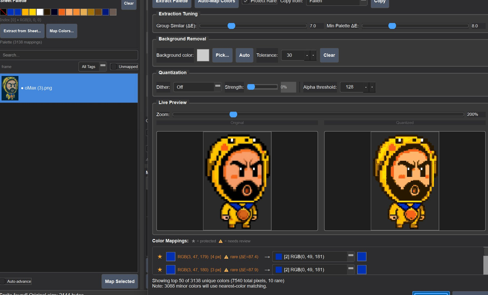
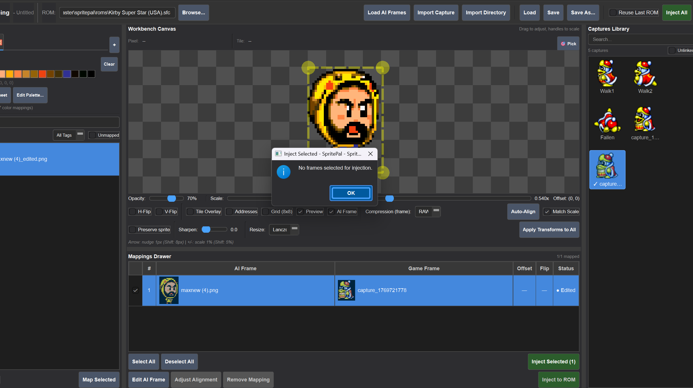
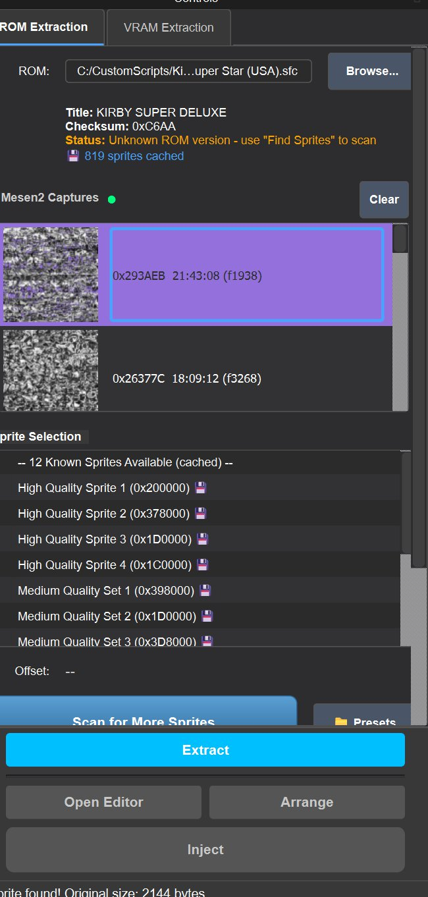
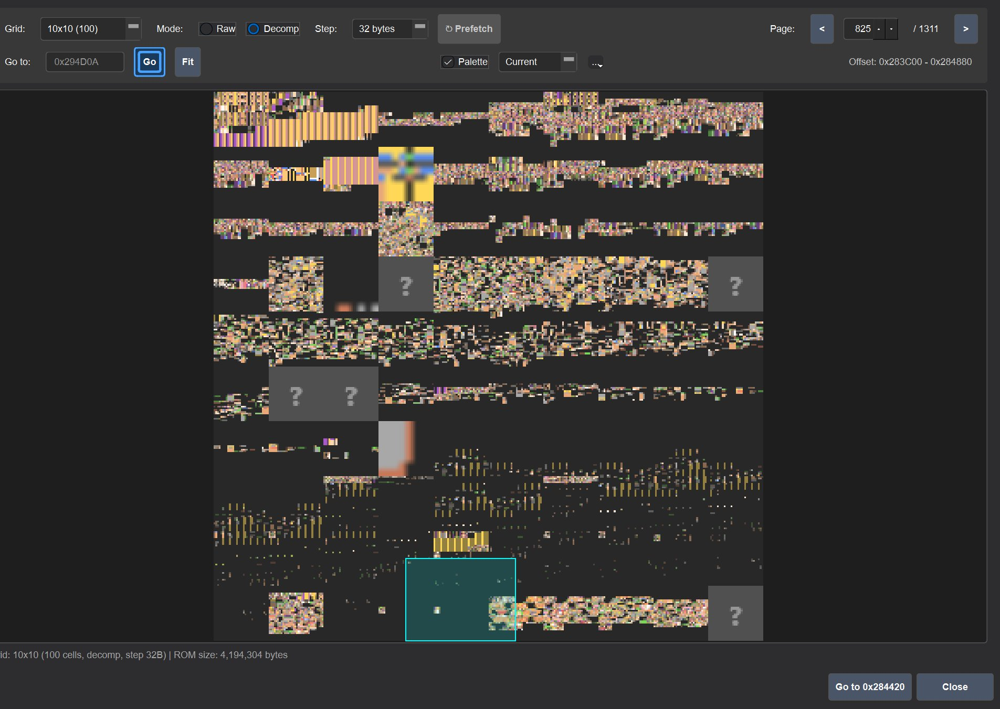
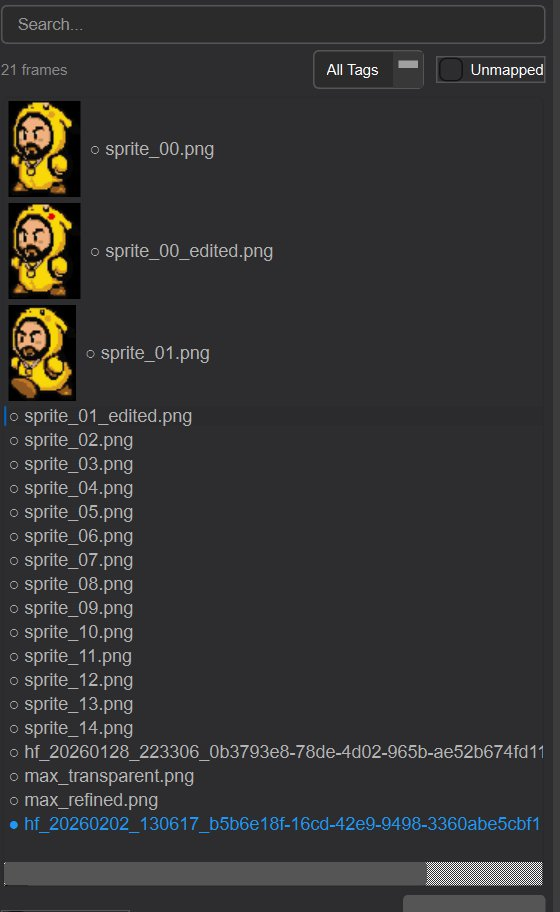

# SpritePal

[](https://python.org)
[](https://doc.qt.io/qtforpython/)
[](tests/)

A PySide6 sprite editor for SNES ROM hacking — extract, edit, and inject sprites with HAL compression.

## Why This Exists

ROM hacking SNES games requires working with sprites stored in proprietary compressed formats. Existing tools are either command-line only, limited to viewing, or lack HAL compression support. SpritePal provides a full extract-edit-inject workflow in a modern GUI, with Mesen 2 emulator integration so you can click a sprite on screen and jump directly to its ROM offset.



## Screenshots

### Sprite Editor — Extract, Edit, Inject

Browse extracted ROM sprites with thumbnails, select palette rows, and edit at the pixel level. The editor supports HAL-compressed and raw sprite data.



### Sheet Palette Editor — Live Quantization Preview

Map AI-generated high-color sprites down to the SNES 15-color palette. The live preview shows original vs. quantized side-by-side, with background removal, color mapping, and dithering controls.



### Frame Mapping Workbench — AI Frame Overlay

Align AI-generated sprite frames over captured game frames on the workbench canvas. Adjust scale, offset, and compression settings before injecting back to ROM.



### Mesen 2 Capture Integration

Click on any sprite in the Mesen 2 emulator and SpritePal picks up the ROM offset automatically. Captures appear in the sidebar with thumbnails and metadata.



### ROM Data Browser — Decompressed Sprite Grid

Scan through the entire ROM as a grid of decompressed tiles. Navigate by page, switch between raw and decompressed views, and jump to any offset to inspect sprite data.



### Sprite Asset Library

Browse all captured and imported sprite frames with search, filtering by tags, and quick mapping controls.



## Features

- **Extract sprites** from SNES ROMs with HAL compression support
- **Edit sprites** directly in embedded editor with full Extract-Edit-Inject workflow
- **Inject modified sprites** back into ROMs with compression
- **Frame Mapping Workspace**: Map AI-generated sprite frames to game animation frames captured from Mesen 2
- **Modern IDE-like UI**: Dock-based layout (QDockWidget) for flexible workspace management
- **Mesen 2 integration**: Click on sprites in emulator to find ROM offset automatically
- **Workbench Canvas**: Interactive sprite alignment with zoom, pan, and in-game preview
- **Multi-threaded thumbnail** generation for fast browsing
- **Keyboard shortcuts** for tab navigation (Ctrl+1/2/3/4) and quick capture access (F6)
- **Session persistence** saves window state, file paths, and recent captures
- **Revert to Original** button to restore a sprite from ROM if edits go wrong
- **Per-category logging** control via Settings for detailed debugging
- **390+ UI integration tests** for signal-driven workflow validation

## Keyboard Shortcuts

| Shortcut | Action |
|----------|--------|
| **Ctrl+1** | Switch to ROM Extraction tab |
| **Ctrl+2** | Switch to VRAM Extraction tab |
| **Ctrl+3** | Switch to Sprite Editor tab |
| **Ctrl+4** | Switch to Frame Mapping tab |
| **F6** | Jump to last Mesen2 capture in Sprite Editor |

## Quick Start

```bash
# Using uv (recommended)
git clone https://github.com/semmlerino/spritepal.git
cd spritepal
uv sync
uv run python launch_spritepal.py
```

## Development Setup

```bash
# Install uv if needed
pip install uv

# Sync dependencies
uv sync --extra dev

# Run tests (QT_QPA_PLATFORM=offscreen is set automatically by conftest.py)
uv run pytest

# Quick triage (for large test suites)
uv run pytest --tb=no -q

# Re-run only failures with details
uv run pytest --lf -vv --tb=short

# Lint
uv run ruff check .

# Type check
uv run basedpyright core ui utils
```

## Sample Assets

Requires SNES ROM files for testing (e.g., Kirby Super Star). ROM files are not included due to copyright.

## Requirements

- Python 3.12+
- PySide6 >= 6.5.0
- uv (for development)

## Embedded Sprite Editor

SpritePal includes an embedded sprite editor as the 3rd tab in the main window. The editor provides:

- **Extract**: Load sprites from ROM using hex offset
- **Edit**: Modify sprite pixels and manage palettes
- **Inject**: Repack and compress modified sprites back into ROM
- **Multi-Palette**: Manage alternative palette variations

### Using with Mesen 2

1. Launch Mesen 2 with the Lua script that finds sprite ROM offsets
2. Click on a sprite in the emulator
3. The script outputs the ROM offset
4. Double-click the captured offset in SpritePal's Recent Captures panel
5. The sprite editor opens automatically with that offset loaded

For details on Mesen 2 integration, see [mesen2_integration/README.md](mesen2_integration/README.md).

## Frame Mapping Workspace

The Frame Mapping workspace (4th tab) helps map AI-generated sprite frames to game animation frames:

**4-Zone Layout:**
```
+-----------------------------------------------------------------------------+
| Toolbar: [Load AI Frames] [Import Capture] [Import Dir] [Load] [Save] [Inject] |
+----------------+-----------------------------+-----------------------------+
|                |                             |                             |
|  AI FRAMES     |     WORKBENCH CANVAS        |   CAPTURES LIBRARY          |
|  (Left Pane)   |     (Center Top)            |   (Right Pane)              |
|                |                             |                             |
+----------------+-----------------------------+                             |
|                |                             |                             |
|                |   MAPPINGS DRAWER           |                             |
|                |   (Center Bottom)           |                             |
|                |                             |                             |
+----------------+-----------------------------+-----------------------------+
```

**Workflow:**
1. Load AI-generated sprite frames (PNG files)
2. Import game captures from Mesen 2
3. Pair frames by selecting one from each side
4. Align sprites using the Workbench Canvas with zoom/pan controls
5. Toggle in-game preview to see composite result
6. Inject paired frames directly to ROM

## Documentation

- [docs/INDEX.md](docs/INDEX.md) - Documentation index
- [docs/architecture.md](docs/architecture.md) - Architecture guidelines
- [tests/README.md](tests/README.md) - Testing guide

## License

MIT
