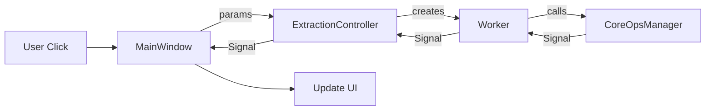

# Codebase Simplification Plan: SpritePal

This document outlines the findings and proposed architectural simplifications for the SpritePal project, focusing on reducing indirection and streamlining signal flow.

## 1. Truth Map: Runtime Flow (VRAM Extraction)

The current workflow involves a "Triple Signal Hop" that increases cognitive load and maintenance overhead.

1.  **Entry:** `MainWindow` ("Extract" button) -> `ExtractionPanel` (params) -> `ExtractionController`.
2.  **Controller:** `ExtractionController.start_extraction()` creates `VRAMExtractionWorker`.
3.  **Worker:** `VRAMExtractionWorker` runs in thread, calls `CoreOperationsManager.extract_from_vram()` (Synchronous).
4.  **Manager:** `CoreOperationsManager` performs the logic and emits signals.
5.  **Signal Chain:**
    *   `CoreOperationsManager` emits `extraction_progress`.
    *   `VRAMExtractionWorker` catches `extraction_progress` -> re-emits `progress`.
    *   `ExtractionController` catches `progress` -> re-emits `status_message_changed`.
    *   `MainWindow` catches `status_message_changed` -> Updates StatusBar.

### Runtime Flow Diagram


## 2. Abstraction Smells & Risks

### Redundant Layers
*   **`ExtractionController` (ui/extraction_controller.py):** Acts as a pure pass-through signal bridge. It adds no logic but requires duplicating signal definitions and connections across three layers.

### Architectural Risks
*   **Infinite Recursion Bug:** In the current `VRAMInjectionWorker` implementation, it calls `start_injection` on the manager, which in turn creates a new `VRAMInjectionWorker`. This circular dependency is a significant stability risk.
*   **God Object:** `CoreOperationsManager` handles extraction, injection, caching, palettes, and navigation, leading to high coupling.

## 3. Prioritized Simplification Plan

### Phase 1: Eliminate the "Pass-Through" Controller (High ROI)
1.  **Enhance Manager:** Add `start_vram_extraction` and `start_rom_extraction` methods to `CoreOperationsManager` to handle worker lifecycle.
2.  **Direct Wiring:** Update `MainWindow` to connect directly to `CoreOperationsManager` signals (e.g., `manager.extraction_progress` -> `statusBar.showMessage`).
3.  **Decommission Controller:** Delete `ui/extraction_controller.py`.

### Phase 2: Signal Standardization
1.  **Payload Typing:** Use Dataclasses for complex signal payloads to avoid "object" typing in PySide6 signals and improve IDE autocomplete.
2.  **Naming:** Standardize signal names across managers to use consistent `verb_past_tense` (e.g., `extraction_started`, `extraction_completed`).

## 4. Target Architecture Sketch

```
ui/
  main_window.py       <-- Observes Manager signals
  rom_extraction/      <-- Specialized UI logic
core/
  managers/
    core_operations.py <-- Manages async worker lifecycle & state
  workers/             <-- Threading wrappers for core logic
  extractor.py         <-- Pure synchronous business logic
```

**Golden Rule:** Signals are for notifications to the UI, not for orchestration between logic layers. Prefer direct method calls for control flow.
